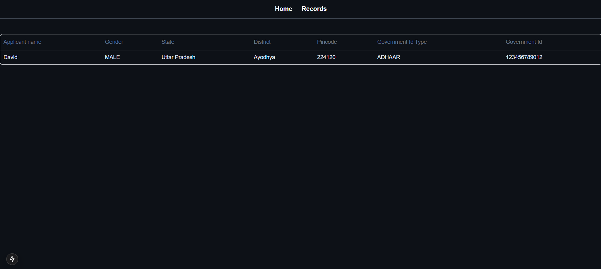

# Plunes - Case Study for Electricity Board 

Created a web application for it’s staff
with capability to view and edit the connections made/requested by the user.
It is a Multi-Page User Interface to keep track of applied connections and
their status.
The application covers the following aspects--:

### PART A
1. Display the records in a grid or tabular format.
2. Search option to look for connection details with Applicant ID.
3. Add a date picker to filter via date range via date of application.
4. Option to view/edit electricity connection application requests.
a. Refer dataset for the data attributes.
b. Could be on same or different page.
5. Data Validation.
a. Should not be allowed to change the Date of Application, Govt ID Type, and ID Number.
b. Load applied should not exceed 200 KV.

### PART B
1. Create a visualization graph e.g., bar or line chart for number of connection requests in every month.
The user should be given flexibility to select status (pending, approved etc.) of choice. (Use some form of
charting library).

## Table of Contents
- [Tech Stack](#tech-stack)
- [Installation](#installation)
- [Environment Variables](#environment-variables)
- [Usage](#usage)
- [Screenshots](#screenshots)

## Tech Stack
- Language: TypeScript
- Frontend: Next.js, Tailwind CSS, and Shadcn
- Backend: Next.js, Zod, and Server actions
- Database: PostgreSQL, Prisma ORM
- Dockerization: Docker engine

## Installation

### 1. Clone the Repository
First, clone this repository to your local machine:

```bash
git clone https://github.com/your-username/your-repo-name.git
```
### 2. Navigate to the Project Directory
Change into the project directory:

```bash
cd your-repo-name
```

### 3. Install Dependencies
Install the required dependencies using pnpm:

```bash
pnpm install
```

### 4. Migrate Schema

```bash
pnpm dlx migrate dev 
```

### 5. Generate Client

```bash
pnpm run db:generate
```

## Environment Variables
Ensure you set up the following environment variables in a .env file of the project:

- DATABASE_URL: URL for your PostgreSQL database

## Usage

### 1. Start the Server
You can start the app by running:

```bash
pnpm run dev
```

## Screenshots





